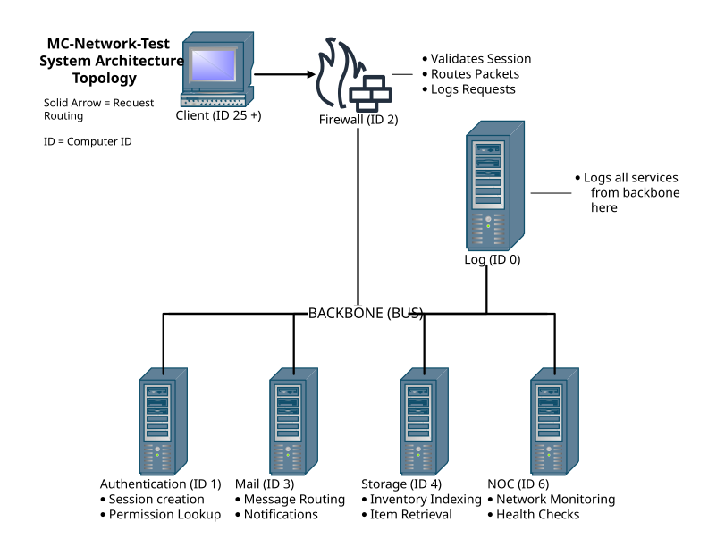
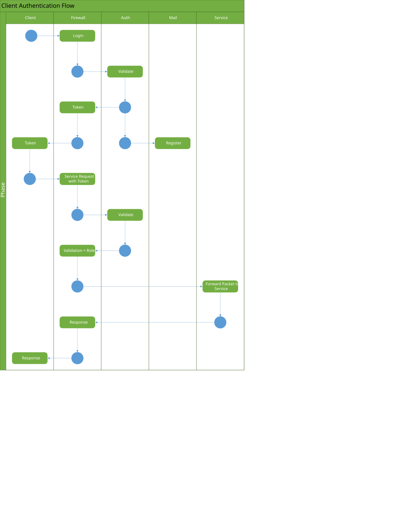
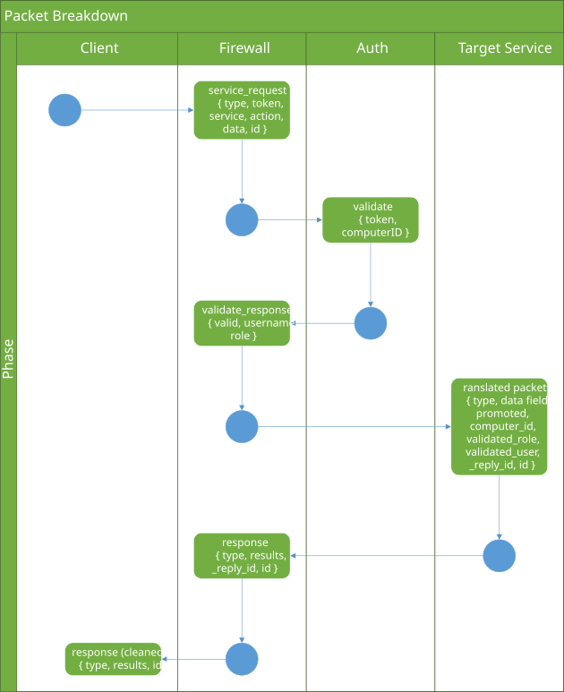

# cctweaked-mesh

A distributed network ("mesh") of independent CC:Tweaked (ComputerCraft)
computers, each running its own service and communicating over `rednet`:
authentication, a firewall gateway, internal mail/alerting, centralized
item storage, system monitoring, and a player-facing terminal client.
Every computer is its own node - there's no single program; the network
itself is the application.

> **Status: work in progress.** This repository currently includes only the
> services that are fully working end-to-end. A crafting/auto-crafting
> service is in active development and redesign, and is intentionally
> excluded from this build until it's stable.

---

## Technologies

- Lua 5.2 (CC:Tweaked)
- ComputerCraft / CC:Tweaked
- Rednet networking
- JSON serialization
- SHA-256 password hashing
- Git

---

## Architecture

Each service runs as its own ComputerCraft computer on a wired network,
identified by a fixed computer ID. A central firewall validates and routes
all client traffic to the appropriate backend service over `rednet`.



| ID | Service        | Responsibility                                          |
|----|----------------|----------------------------------------------------------|
| 0  | `log-server`   | Centralized logging from every other service             |
| 1  | `auth-server`  | User accounts, sessions, role-based access                |
| 2  | `firewall`     | Single entry point for clients; validates & routes packets |
| 3  | `mail-server`  | Internal player mail and system alerts                    |
| 4  | `master-storage`| Indexed item storage with player-requested delivery       |
| 6  | `noc-server`   | Network monitoring; alerts when a service goes offline    |
| 25+| `client`       | Player-facing terminal: login, mail, alerts, storage       |

Services are addressed by fixed computer ID, looked up centrally in
[`shared/lib/network.lua`](shared/lib/network.lua) — no service hardcodes
another service's ID directly.

---

## What's implemented

- **Auth** — account creation, login/logout, session tokens, role-based
  permissions (admin/member/guest), all enforced server-side.
- **Firewall** — every client packet passes through here first; sessions
  are validated before being routed, and only known service names are
  forwarded onward. Acts as the network's single trust boundary.
- **Mail** — internal messaging between players, plus system-generated
  alerts (e.g. from NOC) delivered the same way.
- **Storage** — a request system backed by a physical chest network.
  Clients query what's available and request delivery; storage indexes
  contents and handles fulfillment and overflow.
- **Logging** — every service ships logs to a central log server instead
  of relying on local terminal output, so issues can be diagnosed after
  the fact.
- **NOC (Network Operations Center)** — actively pings every known service
  on an interval and raises an alert (via mail) the moment one goes
  offline.
- **Client** — the actual terminal program a player runs: login screen,
  mail inbox, alerts, and a storage browser/request UI.

### Client authentication flow

How a client logs in and obtains a session token through the firewall and
auth server:



### Packet breakdown

The structure of a packet as it travels from client to firewall to backend
service:



## What's intentionally not here yet

A crafting/auto-crafting service (recipe resolution, multi-step job
queues across smelters/pulverizers/turtles) was built out in an earlier
iteration but is being redesigned around a cleaner, recursive
ingredient-resolution model before it's reintroduced. Rather than ship a
half-working feature, it's been pulled out of this build entirely until
it meets the same bar as everything above.

---

## Installing

On any in-game ComputerCraft computer:

```
wget https://raw.githubusercontent.com/sosheeran/cctweaked-mesh/main/install.lua install
install
```

The installer detects the computer's ID and installs the matching
service automatically (or the client, for any ID 25 and above). Run
`reboot` once it finishes.

## Repository layout

```
servers/      one folder per service (server.lua, startup.lua, lib/)
shared/lib/   code shared by every service (network ID map, logging, hashing)
scripts/      operator tools for the storage server (setup, discovery, health checks)
tests/        standalone diagnostic scripts, run manually
install.lua   single installer used by every computer on the network
```
